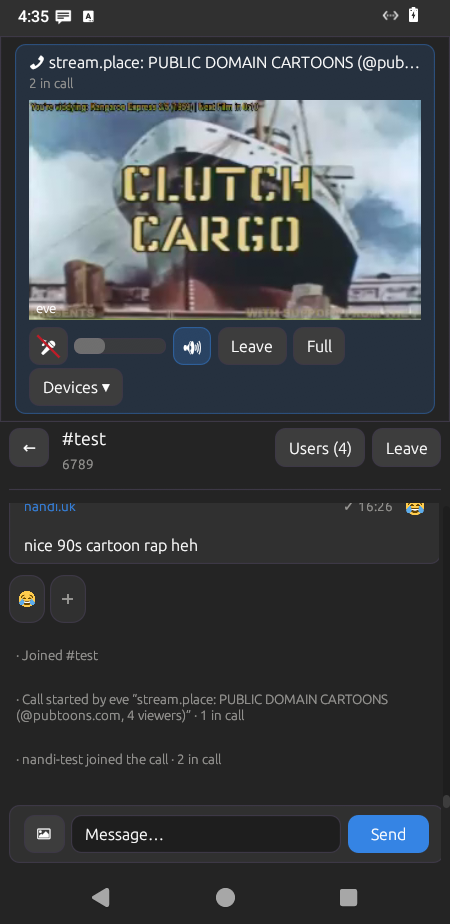

# Sleek

Mobile **freeq** client built with **[Vidya](https://tangled.org/nandi.uk/vidya)** (GNOME/HIG-inspired egui theme) and **[freeq-sdk](https://github.com/codegod100/freeq/tree/main/freeq-sdk)**.

Layout and flows take cues from the freeq Android app: connect (guest), chats list, chat detail, discover, and settings — with a portrait bottom-tab shell.

## Screenshot

Sleek on Waydroid (chat + in-call video):

<p align="center">
  
</p>

## Screens

| Screen | Role |
|--------|------|
| **Connect** | Nick + server, guest connect (TLS default `irc.freeq.at:6697`) |
| **Chats** | Channel/DM list with last preview, unread badges, search, join |
| **Chat** | Message stream + compose bar; Search finds messages across chats |
| **Discover** | Popular channels + custom join |
| **Settings** | Account, connection status, dark/light shell, disconnect |

## Stack

- **UI**: [egui](https://github.com/emilk/egui) + [vidya](https://tangled.org/nandi.uk/vidya) theme/widgets + Android safe chrome
- **Network**: [freeq-sdk](https://github.com/codegod100/freeq/tree/main/freeq-sdk) (guest IRC, TLS / WebSocket)
- **Targets**: desktop host (Wayland/X11) and Android NativeActivity (`cargo-apk` / Waydroid)

## Run

Dev shell + desktop host build work via either **pixi** or **Nix** — pick one.
Android/Waydroid/Flatpak packaging, Buck2, and Cachix pushes below are still
Nix-only (`flake.nix`); `pixi.toml` only replaces `devenv.nix`'s job.

```bash
# pixi (conda-forge toolchain — no /nix/store, works on any Linux box):
pixi install        # once, materializes .pixi/envs/default from pixi.lock
pixi shell           # or: pixi run <task>
just host            # desktop window (cargo run) — same recipe either shell
just lib             # build android package as rlib (desktop target)
```

```bash
just host          # desktop window — buck2 build + run (see BUCK, cargo.bzl)
just lib           # build android package as rlib (desktop target, via buck2)
just waydroid      # cargo-apk → install → launch on Waydroid (x86_64)
# `host` / `lib` re-enter the flake shell themselves — nix develop below is
# only needed for recipes that still call cargo directly (gleam-slash) or
# for an interactive shell:
nix develop        # or: direnv allow  (after .envrc)
# or: ./scripts/enter

# Or via the flake:
nix run            # flake devShell + just host --release (needs sibling vidya/freeq)
nix run .#host     # same as nix run
nix run .#sleek    # pure Nix store binary (hermetic)
nix build .#sleek  # → ./result/bin/sleek
nix build .#flatpak  # → ./result/uk.nandi.sleek.flatpak (GNOME Platform 49)
# flatpak install --user ./result/uk.nandi.sleek.flatpak && flatpak run uk.nandi.sleek

# Waydroid (x86_64 cargo-apk + install/launch + full UI window):
nix run .#waydroid                 # debug: build + install + launch + show-full-ui
nix run .#waydroid-release         # release (optimized + local signing keystore)
nix run .#waydroid -- build        # cargo-apk only
nix run .#waydroid -- launch       # start activity + show-full-ui
# Defaults: 1080×2400 @ density 420 (override with SLEEK_WAYDROID_WIDTH/HEIGHT/LCD_DENSITY)

# Phone APK (aarch64) + adb install:
# Fast iterate (in-tree cargo-apk + deploy — needs sibling vidya/freeq path deps):
nix run .#deploy-android              # cargo apk + adb install -r
nix run .#deploy-android -- --launch  # …and start the activity
nix run .#deploy-android -- --release --launch
# Pure Nix store build (reproducible / Cachix):
just android                   # nix build .#android — auto-pushes to Cachix when auth is set
nix run .#install-android      # adb install -r that store APK
nix run .#install-android -- --launch

# Manual push of an existing out-link:
just push ./result-android

# Desktop Flatpak bundle (from hermetic .#sleek via nix2flatpak):
just flatpak                   # → result-flatpak/*.flatpak
nix build .#flatpak
# Install: flatpak install --user ./result-flatpak/*.flatpak

# `just host` / `just lib` are buck2 under the hood; the raw targets also
# work directly (e.g. for `--show-output`, CI compile-checks with no DISPLAY):
buck2 build //:sleek-host          # → buck-out/…/sleek       (build only, no run)
buck2 build //:sleek-android-lib   # → buck-out/…/libsleek.so
buck2 run //:sleek-host            # same as `just host` minus the DISPLAY/VNC setup
# BuildBuddy remote caching is on by default (shares cargo's output across
# machines/CI when inputs match — see .buckconfig). Needs an API key:
export BUILDBUDDY_API_KEY=…   # org key from https://app.buildbuddy.io/
# No BuildBuddy account? Every build hard-fails without a key — opt out:
cp .buckconfig.local.no-buildbuddy-example .buckconfig.local
# Verbose by default (buck2 -v=2,stderr,full_failed_command); override:
BUCK_VERBOSITY=1 just host
```

### CI artifacts

Merge / PR CI (check + APK + Flatpak) runs on **boxci** — see [`.boxci/pipeline.yml`](.boxci/pipeline.yml) and https://boxci.boxd.sh.

| Path | What |
|------|------|
| [`.github/workflows/boxci-check.yml`](.github/workflows/boxci-check.yml) | PR bridge: trigger `check`, poll, post GitHub `boxci` commit status |
| [`.github/workflows/boxci-merge.yml`](.github/workflows/boxci-merge.yml) | On push to `main`, trigger boxci merge pipeline |
| `./scripts/boxci/dispatch-check.sh` | Manual check dispatch (+ optional `--wait`) |
| `./scripts/boxci/dispatch-merge.sh` | Manual merge dispatch |

| Job | Flake attr | Artifact |
|-----|------------|----------|
| APK | `.#android` | `sleek.apk` |
| Flatpak | `.#flatpak` | `uk.nandi.sleek.flatpak` |

CI APKs are signed with the committed `android/ci.keystore` (password `android`, alias `androiddebugkey`) so successive installs upgrade cleanly. If you previously installed a build signed with a different key (e.g. an older CI artifact or a local `deploy-android` keystore), uninstall Sleek first — Android shows that as “Something went wrong / App not installed”.

### Spindle (Tangled CI)

[`.tangled/workflows/packages.yml`](.tangled/workflows/packages.yml) also builds `.#android` and `.#flatpak` on nixbuild.net (via `scripts/ci-nixbuild.sh`, same remote-builder + streamed-artifact setup as boxci) on pushes/PRs to `main` (and manual runs). On `main` pushes it force-moves annotated tag `dev` and republishes Tangled assets (`sleek.apk`, `uk.nandi.sleek.flatpak`) onto that tag.

| Secret | Purpose |
|--------|---------|
| `NIXBUILD_TOKEN` | nixbuild.net auth token — remote compile |
| `DEPLOY_KEY` | Write SSH deploy key — push/move tag `dev` |
| `ATP_APP_PASSWORD` | ATProto app password — upload Tangled assets |

Optional: `ATP_IDENTIFIER` (default `nandi.uk`), `ATP_PDS`. Uses the **microvm** engine.

### Cachix

Bootstrap configures **pull** from `https://codegod100.cachix.org` and installs the `cachix` CLI.

On multi-user Determinate Nix, pull only works when the cache is a **trusted
substituter** (not merely listed in the flake `nixConfig`). Bootstrap writes
`extra-substituters`, `extra-trusted-substituters`, and
`extra-trusted-public-keys` to `/etc/nix/nix.custom.conf` (Determinate’s durable
include) and reloads `nix-daemon`. Without that, `nix run` / `nix build` print
`ignoring untrusted substituter` and compile toolchain deps from source.

With `CACHIX_AUTH_TOKEN` set, **`just android` auto-pushes** via `cachix watch-exec` (every new store path from that build, including SDK/NDK on cold builds).

On every push to `main`, [`.github/workflows/cachix.yml`](.github/workflows/cachix.yml) builds `.#sleek` and `.#android` on nixbuild.net and pushes store paths to the same cache. CI pulls `NIXBUILD_TOKEN` and `CACHIX_AUTH_TOKEN` from **OpenBao** (`https://openbao.boxd.sh`, KV paths `secret/data/ai-api-keys` then `secret/data/cachix`) via `scripts/fetch-openbao-env.sh`.

| Secret / env | Purpose |
|--------------|---------|
| `OPENBAO_TOKEN` | OpenBao token — Cursor env + **GitHub Actions** secret; CI uses it to fetch nixbuild + Cachix credentials |
| `GH_TOKEN` | GitHub PAT in OpenBao (`ai-api-keys`) — bootstrap reconfigures `gh` so agents can manage Actions secrets |
| `NIXBUILD_TOKEN` | nixbuild.net auth token in OpenBao — remote CI builds |
| `CACHIX_AUTH_TOKEN` | Write token in OpenBao / Codespaces ([cachix.org](https://app.cachix.org) → codegod100) |
| `CACHIX_CACHE` | Cache name (default `codegod100`) |
| `SLEEK_CACHIX_PUSH=0` | Disable auto-push for one build |
| `SLEEK_SKIP_CACHIX=1` | Skip Cachix setup in bootstrap |

```bash
# Proper gh for agents/CI setup (run where `gh auth status` is your account):
export OPENBAO_ADDR=https://openbao.boxd.sh
export OPENBAO_TOKEN=…                 # same value as Cursor env secret
./scripts/openbao-put-key.sh GH_TOKEN --from-gh
printf '%s' "$OPENBAO_TOKEN" | gh secret set OPENBAO_TOKEN -R codegod100/sleek
```

```bash
# Codespace secret → then:
just bootstrap
just android                   # build + push
SLEEK_CACHIX_PUSH=0 just android   # build only
```

The dev shell does **not** set ambient `LD_LIBRARY_PATH` (that broke Ubuntu
`git pull` on Codespaces via nix openssl/glibc). Runtime libs for the desktop
host live in `SLEEK_LD_LIBRARY_PATH` and are applied by `just host` only.

If you still see `GLIBC_ABI_DT_X86_64_PLT` on an old session:

```bash
unset LD_LIBRARY_PATH
./scripts/enter          # re-enter flake shell (nix git/curl on PATH)
git pull
```

Guest connect defaults:

- Server: `irc.freeq.at:6697` (TLS)
- Nick: random `sleekXXXX` (editable)

On Android, the client prefers WebSocket (`wss://host/irc`) when the host looks like a freeq public server; desktop uses TLS TCP by default and can fall back to WebSocket via the connect form.

## Codespaces / `gh codespace ssh`

Codespaces uses a **nix-codespace** setup: Ubuntu 24.04 base, Nix installed
by bootstrap (not the official Nix *feature* — that feature’s `/nix` volume
mount often fails Codespace create and drops you into Alpine recovery), with
**flakes and `nix-command` always enabled** (no
`--extra-experimental-features` flags).

| Piece | Role |
|-------|------|
| `.devcontainer/devcontainer.json` | Ubuntu base + desktop-lite (VNC) + `NIX_CONFIG` + postCreate bootstrap |
| `scripts/ensure-nix-flakes.sh` | writes user/system `nix.conf` + `NIX_CONFIG` so flakes stay on |
| `.envrc` | direnv `use flake` |
| `scripts/enter` | manual / scripted re-exec into `nix develop` |
| `scripts/codespace-env.sh` | sourced from `~/.bashrc` on interactive login |
| `scripts/codespace-bootstrap.sh` | installs nix (Determinate), flakes config, direnv, bashrc hook, warms flake |

### Desktop GUI over VNC (noVNC)

The devcontainer includes **[desktop-lite](https://github.com/devcontainers/features/tree/main/src/desktop-lite)**
(Fluxbox + TigerVNC + noVNC) so the egui host can run in the browser.

| Port | Use |
|------|-----|
| **6080** | noVNC web client (open from the Ports panel → Globe) |
| **5901** | Raw VNC (optional local viewer) |

Desktop geometry defaults to **1280×720** (`VNC_RESOLUTION`). desktop-lite’s stock
1440×768 is often **larger than the browser pane**, so you pan/scroll the remote
desktop. noVNC is configured to **Local scaling** (fit the browser). Prefer:

```text
https://<codespace>-6080.app.github.dev/vnc.html?resize=scale&autoconnect=true&password=vscode
```

Or Settings (gear) → Scaling mode → **Local scaling**. Override size with
`SLEEK_VIEWPORT=1280x720` when starting the host.

**Bluesky login (desktop / VNC):** the VNC desktop has no system browser by
default. Bootstrap installs Chromium via nix and sets `BROWSER` to
`scripts/vnc-browser.sh` (`--no-sandbox` for Codespaces). Sign-in opens
Chromium inside noVNC and completes OAuth against loopback `127.0.0.1`. If the
browser does not open, paste a `freeq://auth?…` link into the connect form.

**Bluesky login (Android APK):** the broker is opened with `mobile=1` so the
callback is `freeq://auth?…`. The APK registers a `VIEW` intent-filter on
scheme `freeq` (`SleekActivity`, `singleTask`) and resumes the app with tokens
— no manual window switch or paste.

1. Create / open a Codespace on this repo (rebuild if the container predates desktop-lite).
2. Wait for bootstrap (`nix develop` warms; first boot can take several minutes).
3. In the **Ports** view, open **6080** (label: *noVNC desktop*), or use the
   `?resize=scale` URL above.
4. Click **Connect**, password: **`vscode`**.
5. In the Codespace terminal (or via `gh codespace ssh`):

```bash
# One-shot: clone sibling freeq+vidya if needed, then run on VNC :1
just codespace-host          # foreground
just codespace-host --bg     # background → /tmp/sleek-logs/host.log

# Or only the desktop host (deps already present):
just host
# or (cargo run --release via flake app):
nix run
```

From a laptop:

```bash
gh codespace ssh -c <name> -- bash /workspaces/sleek/scripts/codespace-host.sh --bg
```

The window appears on the Fluxbox desktop inside noVNC. Right-click the
desktop for the Fluxbox menu.

Bare commands work after bootstrap:

```bash
nix develop          # no flags
nix build
nix run
just host
```

```bash
# Create / open a codespace on this repo, then:
gh codespace ssh
# → bashrc sources codespace-env.sh → nix develop (rustc, just, …)

# Opt out for one session:
SLEEK_NO_AUTO_NIX=1 gh codespace ssh

# Force enter without login hook:
./scripts/enter
./scripts/enter just host
```

First create runs `codespace-bootstrap.sh` (nix install + flake warm can take
a few minutes). Later SSH sessions re-enter the shell only.

If you land on **Alpine** (“Welcome to Alpine!”) with no `nix`, the dev
container failed and Codespaces is in recovery mode. Delete that codespace and
create a new one from `main` after the Ubuntu+bootstrap config is pushed.

## Layout

```
sleek/
  android/          # shared lib: UI + freeq-sdk bridge (cdylib for APK)
  host/             # desktop binary
  assets/           # desktop entry + icons (Flatpak / host)
  .tangled/         # Spindle CI (Tangled)
  scripts/          # enter, codespace shim, flakes ensure, Waydroid
  .github/workflows # CI: APK + Flatpak artifacts
  .devcontainer/    # GitHub Codespaces (nix feature + flakes)
  .envrc            # direnv → flake
  justfile
  flake.nix         # .#sleek, .#android, .#flatpak, …
```

## License

MIT
